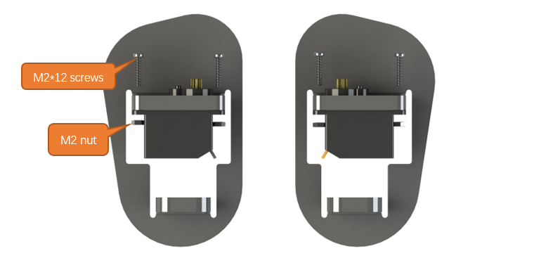

##############################################################################
Chapter 0 Assembling Bipedal Robot
##############################################################################

**If you have any concerns, please feel free to contact us via** support@freenove.com

Assembling the Robot
*******************************************

Plugging in Raspberry Pi Pico (W)
===========================================

Plug Raspberry Pi Pico (W) into the shield.

Please pay attention to the orientation of Raspberry Pi Pico (W). Do NOT reverse it; Otherwise, it may burn the Raspberry Pi Pico (W).

Installing Disk Servo Arm
===========================================

Take out four disk servo arms from the servo packages. 

.. image:: ../_static/imgs/0_Assembling_Bipedal_Robot/Assembling01.png
    :align: center

Each servo package includes five M1.4x8 screws and two black servo screws.

There are 4 pairs of opposite holes on the disk servo arm, and the distance between each pair is different. Please use the 2 pairs of holes with longer distance. 

Installation steps:

Step 1 The following illustrates the installation of the disc servo arms of the servos for the body. Use the M1.4x8 screws in the servo package.

.. image:: ../_static/imgs/0_Assembling_Bipedal_Robot/Assembling03.png
    :align: center

Step 2 The following illustrates the installation of the disc servo arms of the servos for the leg. Use the M1.4x8 screws in the servo package.

Installing Servo
===========================================

Installation steps:

Step 1 Assemble the servos to the two legs with M2*12 screws and M2 nuts.

Finished:

Step 2 Assemble the servos to both feet with M2*12 screws and M2 nuts.

Finished:

Step 3 Assemble the servos to the robot. Connect Servos 1, 2, 3, and 4 to the corresponding port on the robot board, which are GPIO10, GPIO11, GPIO12, and GPIO13 respectively. Pay attention to the colors of the cables. Connect the yellow cable to the yellow pin, red to red and brown to black. Do not misalign the cables. 

Open “00.0_Servo_90” in “Freenove_Bipedal_Robot_Kit_for_Raspberry_Pi_Pico\\Sketches” and double-click “00.0_Servo_90.ino”. For details, please refer to :ref:`here <upload>`.

Turn ON the power switch, run the servo installation program, and the servos will keep at 90°.

Assemble the servos to the acrylic parts with the black screws in the servo packages.

Make them as close to 90° as possible. It is acceptable that the angle is in the range of 80 – 100 degrees.

Assemble the leg support screws: Fix the M3 nut with the M3 spanner and screw the the M3 screws in. Please note that the M3 nuts here are self-locking non-slip nuts and the srews serve as supports, so you do not need to screw them too tight and some space is needed, so that the feet can move more flexible. 

If your robot is stuck when walking, please check if the screws are fixed too tight. 

When assembling the leg supporting rivets with the spanner,  you can tilt it at certain angles to facilitate assembly.

Installing Ultrasonic Module
===================================

Step 1 Install ultrasonic module. 

Installing LED Matrix Module
============================================================

Step 1 Install LED matrix module. 

Installing 9V Batteries
===================================

This robot is powered with :red:`9V alkaline batteries` or :red:`9V NIMH rechargeable batteries` as power supply. Please note that 9V carbon batteries and 9V rechargeable lithium batteries cannot provide enough power for the robot. Therefore, it is important to pay attention to the battery model when purchasing batteries.

Step 1 Installed with batteries.

Correctly install the batteries. 

Here we provide two installation methods:

Method 1:

Method 2:

Among them, M2x5 is the acrylic element, and there are 6 M2x5 rings in the acrylic fitting. Only three are used here, and the remaining three are reserved for use.

Connecting Servo Cables
============================================================

Step 1 Connect the servo cables. Thread the servo wires through the hole on the acrylic part and connect them to the servo port on the robot shield.

Connect the Ultrasonic Sensor and LED Matrix Module
============================================================

Step 1 Connect the ultrasonic sensor and LED matrix module. It is important that the pins be connected in line with the silk print on the robot shield.

Installing the Standoffs for Robot Shield
============================================================

Fix the robot shield.

Installing the Speaker
============================================================

Step 1 Attach the speaker to the robot.

The red line of the speaker here is connected to the interface marked 3V3 on the control board.

Installing Robot Shield
============================================================

Step 1 Install the robot shield.

Plugging in Raspberry Pi Pico (W)
============================================================

Plug Raspberry Pi Pico (W) into the shield.

Please pay attention to the orientation of Raspberry Pi Pico (W). Do NOT reverse it; Otherwise, it may burn the Raspberry Pi Pico (W).

Installing Bluetooth Module
============================================================

Plug the Bluetooth module to the board.  Pay attention to the direction.

Installing 9V Battery Holder (with batteires installed)
============================================================

Install the batteries to power the robot. Please note that the input voltage should be 7-9.5V.  Although it is a 9V battery, its actual voltage can exceed this number. It is acceptable as long as the voltage is within 10V. When installing the batteris, you may press the battery down and push it to the end.

.. image:: ../_static/imgs/0_Assembling_Bipedal_Robot/Assembling27.png
    :align: center

.. note:: When the robot is not in use, please take out the batteries to avoid draining them.

It is recommended to buy rechargeable batteries; whichi is more environment-friendly.

How to Play
*****************************************

Add libraries
===========================================

Open the **Arduino IDE**, Click **Sketch** on the menu bar -> **Include Library** -> **Add .ZIP Library...**

In the new pop-up window, select **Freenove_Bipedal_Robot_Kit_for_Raspberry_Pi_Pico\\Libraries** , select every Library, click **Open**, and repeat this process until you have installed all six Libraries into the Arduino.

These libraies are used for this robot. Before uploading code, please make sure they have beed added.