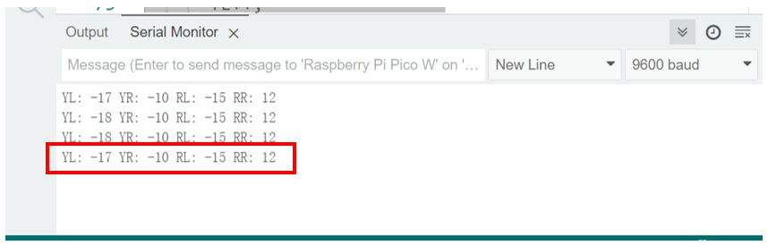
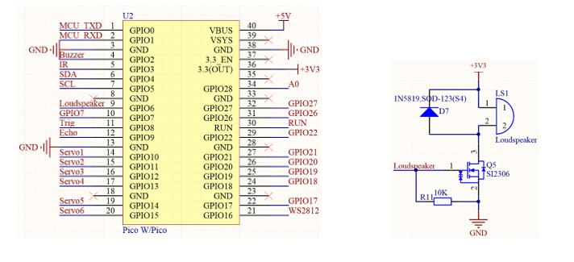
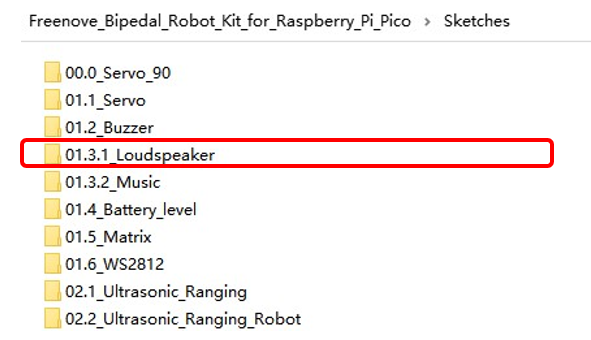

##############################################################################
Module test 
##############################################################################

If you have any concerns, please feel free to contact us via support@freenove.com

Servo
*********************************

Servo
=================================

Servo is a compact package, which consists of a DC motor, a set of reduction gears to provide torque, a sensor and control circuit board. Most servos only have a 180-degree range of motion via their “horn”. Servos can output higher torque than a simple DC motor alone and they are widely used to control motion in model cars, model airplanes, robots, etc. Servos have three wire leads that usually terminate to a male or female 3-pin plug. Two leads are for electric power: positive (2-VCC, Red wire), negative (3-GND, Brown wire), and the signal line (1-Signal, Orange wire), as represented in the Servo provided in your Kit. 

We will use a 50Hz PWM signal with a duty cycle in a certain range to drive the Servo. The lasting time of 0.5ms-2.5ms of PWM single cycle high level corresponds to the servo angle 0 degrees - 180 degree linearly. Part of the corresponding values are as follows:

.. list-table::
    :align: center
    :header-rows: 1

    * - High level time
      - Servo angle
    * - 0.5ms
      - 0 degree
    * - 1ms
      - 45 degree
    * - 1.5ms
      - 90 degree
    * - 2ms
      - 135 degree
    * - 2.5ms
      - 180 degree 

When you change the servo signal value, the servo will rotate to the designated angle.

Schematic
=================================

Clibration for the Four Servos
=================================

Here are three ways to calibrate the servos. 

The first two methods require connecting the pico board to your computer with an USB cable, while the third one is achieved via Bluetooth, which is a wireless way. You can chose either method, as you prefer.

Nevertheless, the third method is more recommended, as the USB cable may affect the movement of the robot. It is more convenient and quicker to use the third method for calibration.

Method 1:

Calibrate through serial communication.

Upload sketch 01.1.1_Servo_Calibration to the Raspberry Pi Pico. After uploading successfully, click the serial monitor on Arduino IDE. Press the corresponding keys, on the keyboard to calibrate each servo. 

The specific calibration command characters are as follows:

.. list-table::
    :align: center
    :header-rows: 1

    * - Servo interface
      - The servo was increased by 1°
      - The servo is reduced by 1°

    * - LeftLeg [10]
      - q
      - a

    * - RightLeg [12]
      - e
      - d

    * - LeftFoot [11]
      - w
      - s

    * - RightFoot [13]
      - r
      - f

Enter o to save the calibrate data to the pico board.

Method 2:

This method also uses serial communication to calibrate the servos. There are two ways to achieve this.

1.	Directly run the executable file to calibrate. You only need to double click the file to run it.

2.	Enter commands to run the calibration tool. If you choose this, you need the following preparation:
    
    2.1	Install python on your computer.
    
    2.2	Install pyseiral library by running the command pip3 install pyserial.

    .. image:: ../_static/imgs/1_Module_test/Module02.png
        :align: center
    
    2.3	Enter the command to enter the directory where the file locates, and then run python calibration.py to run the calibration tool.

    .. image:: ../_static/imgs/1_Module_test/Module03.png
        :align: center
    
You will see the calibration tool open after the above steps.

Before using the calibration tool, you need to upload sketch 01.1.2_Servo_Calibration_PC_Tools to the pico board.

The following shows you how to calibrate the servos with the tool.

    1.	Select the serial port. (Make sure that the port is not occupied by your computer, and that the serial debugger tool on Arduino IDE is close, otherwise the connection will fail.)

    2.	Click the servo to calibrate. The four blue boxes represent the four servos. When one is selected, it will turn red. Calibrate the four servos one by one.

    3.	After all the four servos are calibrated, click the movement buttons (Forward, Back, Left, Right, Stop) to see if the servos work correctly.

    4.	If they work as expected, click the Save button.

    5.	If the servos does not work correctly in future operation, please recalibrate them.

.. note::
    
    When you open the calibration tool next time, you can click the Get value button to get the servo angle data saved on the pico board. In this way, the servos can roate back to the last calibration value. You can calibration based on this value.

The above two methods require connecting the pico board to computer with an usb cable.

Method 3 (wireless):

Calibrate the servo angles via Bluetooth wireless connection. 

    1.	Upload the corresponding code to pico (see the sketch section for detail). Open Freenove app on your phone and connect to the Bluetooth named “BT05”.

    2.	After connecting successfully, tap the calibration icon on the app. At this point, it will get the angle data of the four servos.

    3.	Select each servo to calibrate.

    4.	Tap the SAVE ALL button after the four servos are calibrated, and close the calibration window.

    5.	Test the robot's movement by tapping the movement buttons on the homepage. Check whether the servos move in line with the button tapped.

    6.	Similarly, if the servos work abnormally, you can recalibrate them.

.. note::

    1.	Please make sure the Bluetooth module is correctly connected to avoid burning it.

    2.	Please take out the batteries when the robot is put idle to avoid draining them.

Sketch
============================

Servo_Calibration
----------------------------

Upload the sketch to Raspberry Pi Pico (W). This sketch is for servo calibration. You can adjust the robot's status via keyboard input, until the robot can stand up normally. After calibration, you can send the character t for the robot to move forward. Pay attention to the robot’s movement, if it does not walk well, you can adjust each servo again until the robot’s movement is normal. After the calibration finishes, you need to modify the code according to the calibration data and upload the sketch again. Refer to the sketch for more details.

Open “01.1.1_Servo_Calibration” in “ **Freenove_Bipedal_Robot_Kit_for_Raspberry_Pi_Pico\\Sketches** ” and double-click “01.1.1_Servo_Calibration.ino”. 

As indicated below, a character is sent via the serial monitor to calibrate the robot.

The specific calibration command characters are as follows:

.. list-table::
    :align: center
    :header-rows: 1

    * - Servo interface
      - The servo was increased by 1°
      - The servo is reduced by 1°

    * - LeftLeg [10]
      - q
      - a

    * - RightLeg [12]
      - e
      - d

    * - LeftFoot [11]
      - w
      - s

    * - RightFoot [13]
      - r
      - f

Press O to save the current servo angle data to the pico board.

Code
'''''''''''''''''''''''''''''''''

.. literalinclude:: ../../../freenove_Kit/Sketches/01.1.1_Servo_Calibration/01.1.1_Servo_Calibration.ino
    :linenos:
    :language: cpp
    :dedent:

Code Explanation
'''''''''''''''''''''''''''''''''

Include the header files for controlling the robot. Each time before the servos being controlled, the header files need to be included first.

.. literalinclude:: ../../../freenove_Kit/Sketches/01.1.1_Servo_Calibration/01.1.1_Servo_Calibration.ino
    :linenos:
    :language: cpp
    :lines: 21-25
    :dedent:

The serial monitor prints the current servo calibration value when receiving data.

.. literalinclude:: ../../../freenove_Kit/Sketches/01.1.1_Servo_Calibration/01.1.1_Servo_Calibration.ino
    :linenos:
    :language: cpp
    :lines: 71-74
    :dedent:

:red:`After finish calibration, it will record the final calibration data. Please modify the code according to the final data and upload the code again.`

.. literalinclude:: ../../../freenove_Kit/Sketches/01.1.1_Servo_Calibration/01.1.1_Servo_Calibration.ino
    :linenos:
    :language: cpp
    :lines: 33-33
    :dedent:

Servo_Calibration_PC_Tools
---------------------------------

Upload this sketch to the Raspberry Pi Pico (W). This sketch corresponds to the PC Servo Calibration Tool. You can calibrate the servo angle by clicking the corresponding servo button. After the calibration is completed, click the Save button. When testing the robot's movement, if it does not move well, you can readjust each servo until the robot moves normally.

Code
'''''''''''''''''''''''''''''''''

.. literalinclude:: ../../../freenove_Kit/Sketches/01.1.2_Servo_Calibration_PC_Tools/01.1.2_Servo_Calibration_PC_Tools.ino
    :linenos:
    :language: cpp
    :dedent:

Parses the serial port data received by the serial port.

.. literalinclude:: ../../../freenove_Kit/Sketches/01.1.2_Servo_Calibration_PC_Tools/01.1.2_Servo_Calibration_PC_Tools.ino
    :linenos:
    :language: cpp
    :lines: 58-76
    :dedent:

Execute the corresponding task according to the received serial port command.

.. literalinclude:: ../../../freenove_Kit/Sketches/01.1.2_Servo_Calibration_PC_Tools/01.1.2_Servo_Calibration_PC_Tools.ino
    :linenos:
    :language: cpp
    :lines: 108,122,139
    :dedent:

Servo_Calibration_Bluetooth
-----------------------------------------

Upload this sketch to the Raspberry Pi Pico (W). This sketch corresponds to the way of calibration via phone app. You can calibrate the servo angle by clicking the corresponding servo button. After the calibration is completed, click the Save button. When testing the robot's movement, if it does not move well, you can readjust each servo until the robot moves normally.

Code
'''''''''''''''''''''''''''''''''''''''''

.. literalinclude:: ../../../freenove_Kit/Sketches/01.1.3_Servo_Calibration_Bluetooth/01.1.3_Servo_Calibration_Bluetooth.ino
    :linenos:
    :language: cpp
    :dedent:

Initialize the Bluetooth module, set the baud rate of the Bluetooth module and the Bluetooth name.

.. literalinclude:: ../../../freenove_Kit/Sketches/01.1.3_Servo_Calibration_Bluetooth/01.1.3_Servo_Calibration_Bluetooth.ino
    :linenos:
    :language: cpp
    :lines: 94-98
    :dedent:

Similar to serial communication, according to the received Bluetooth data, the corresponding function is executed.

.. literalinclude:: ../../../freenove_Kit/Sketches/01.1.3_Servo_Calibration_Bluetooth/01.1.3_Servo_Calibration_Bluetooth.ino
    :linenos:
    :language: cpp
    :lines: 134-184
    :dedent:

Servo
----------------------------------------

If the robot has passed the tests of moving forward, backward, left, and right in the calibration section, you can skip this test. 

Open “01.1.4_Servo” in “ **Freenove_Bipedal_Robot_Kit_for_Raspberry_Pi_Pico\\Sketches** ” and double-click “01.1.4_Servo.ino”. 

Please check whether the calibration is completed. If the calibration operation is not performed, please carry out the corresponding calibration steps and upload the code.

Upload the code to Raspberry Pi Pico (W). After the code uploads successfully, the robot will walk forward, backward, turn left and turn right, which repeats in a cycle.

Code
'''''''''''''''''''''''''''''''''''''''''

.. literalinclude:: ../../../freenove_Kit/Sketches/01.1.4_Servo/01.1.4_Servo.ino
    :linenos:
    :language: cpp
    :dedent:

Code Explanation
'''''''''''''''''''''''''''''''''''''''''

In tha main loop, the robot moves forward and backword, turn left, and turn right repeatedly.

.. literalinclude:: ../../../freenove_Kit/Sketches/01.1.3_Servo_Calibration_Bluetooth/01.1.3_Servo_Calibration_Bluetooth.ino
    :linenos:
    :language: cpp
    :lines: 45-57
    :dedent:

Buzzer
*****************************************

Buzzer
=========================================

Buzzer is a sounding component, which is widely used in electronic devices such as calculator, electronic warning clock and alarm. Buzzer has two types: active and passive. Active buzzer has oscillator inside, which will sound as long as it is supplied with power. Passive buzzer requires external oscillator signal (generally use PWM with different frequency) to make a sound.

Active buzzer is easy to use. Generally, it can only make a specific frequency of sound. Passive buzzer requires an external circuit to make a sound, but it can be controlled to make a sound with different frequency. The resonant frequency of the passive buzzer is 2kHz, which means the passive buzzer is loudest when its resonant frequency is 2kHz.

:red:`How to identify active and passive buzzer`

1.	Usually, there is a label on the surface of active buzzer covering the vocal hole, but this is not an absolute judgment method.

2.	Active buzzers are more complex than passive buzzers in their manufacture. There are many circuits and crystal oscillator elements inside active buzzers; all of this is usually protected with a waterproof coating (and a housing) exposing only its pins from the underside. On the other hand, passive buzzers do not have protective coatings on their underside. From the pin holes viewing of a passive buzzer, you can see the circuit board, coils, and a permanent magnet (all or any combination of these components depending on the model.

The buzzer used in this robot is a passive buzzer that can make sounds with different frequence.

Schematic
============================================

As we can see, the buzzer is controlled by GPIO2 of Raspberry Pi Pico W. When the buzzer receives PWM signal, NPN will be activated to make the buzzer sound. When the buzzer receives no signal, it will be controlled at low level by R2 and NPN will not be activated, so the buzzer will not make any sounds. 

Sketch
============================================

In this section, we will test the buzzer to make it sound like an alarm.

Open “01.2_Buzzer” folder in the “ **Freenove_Bipedal_Robot_Kit_for_Raspberry_Pi_Pico\\Sketches** ”, and then double-click “01.2_Buzzer.ino”.

Code
---------------------------------------------

.. literalinclude:: ../../../freenove_Kit/Sketches/01.2_Buzzer/01.2_Buzzer.ino
    :linenos:
    :language: cpp
    :dedent:

After the program is downloaded to Raspberry Pi Pico (W), the buzzer emits four short beeps, repeating for three times.

Code Explanation
----------------------------------------------

Configure the PWM of Raspberry Pi Pico (W) to associate it with GPIO2 pin to control the buzzer to make sounds.

.. code-block:: c
    :linenos:

    void Buzzer_Setup(void);                //Buzzer initialization

Control the buzzer to sound regularly. Parameter beat represents the number of times the buzzer sounds in each sounding cycle and rebeat represents how many cycles the buzzer sounds.

.. code-block:: c
    :linenos:

    void Buzzer_Alert(int beat, int rebeat);//Buzzer alarm function

Loudspeaker
*******************************************************

Loudspeaker
=======================================================

Besides the buzzer, we still have a loud speker as sound device, which is directly controlled by the Raspberry Pi Pico. However, please note that its sound quality is not so good. If you want better sound quality, you can connect audio conveter module to spare GPIO pins for extended use.

In this project, we use the speaker to play a piect of music. If you just use the speker to make simple sounds, you can refer to the example of the buzzer and modify the pins accordingly.

Schematic
-------------------------------------------------------

As can be seen, the robot plays audio via GPIO6 of Raspberry Pi Pico (W).

   
Add libraries
========================================================

Method 1
------------------------------------------------------

Open Arduino IDE, click Sketch on Menu bar -> Include Library -> Manage Libraries.

Or click the shortcut icon on the left.

There is an input field on the right top of the pop-up window. Enter ESP8266Audio there and click to install the library boxed in the following figure. 

Wait for the installation to finish.

Method 2
------------------------------------------------------

Open Arduino IDE, click Sketch on Menu bar->Include Library ->Add .ZIP library.

On the pop-up window, select ESP8266Audio.zip in Libraries folder under 

“ **Freenove_Bipedal_Robot_Kit_for_Raspberry_Pi_Pico\\Libraries** ”, and then click Open.

Sketch
=============================================

Loudspeaker
--------------------------------------------

In this section, we use GPIO6 of the Raspberry Pi Pico (W). This example is the same as the buzzer example, so the result is the same.

Open “01.3.1_Loudspeaker” folder in “ **Freenove_Bipedal_Robot_Kit_for_Raspberry_Pi_Pico\\Sketches** ” and then double-click “01.3.1_Loudspeaker.ino”. 

Code
''''''''''''''''''''''''''''''''''''''''''''

.. literalinclude:: ../../../freenove_Kit/Sketches/01.3.1_Loudspeaker/01.3.1_Loudspeaker.ino
    :linenos:
    :language: cpp
    :dedent:

Code Explanation
''''''''''''''''''''''''''''''''''''''''''''

This code is the same as the buzzer code, except for the different GPIO used. In the buzzer example, we use GPIO 2 and in this one, we use GPIO 6.

.. code-block:: cpp
    :linenos:

    #define PIN_BUZZER 6

Music
--------------------------------------------

In this section, we will use GPIO6t of the Raspberry Pi Pico to play audio. After the code upload successfully, it will play a piece of music.

Open “01.3.2_Music” folder in “ **Freenove_Bipedal_Robot_Kit_for_Raspberry_Pi_Pico\\Sketches** ” and then double-click “01.3.2_Music.ino”.

Install the PicoLittleFS tool
''''''''''''''''''''''''''''''''''''''''''''

The latest Arduino IDE has supported LittleFS plugins.

The steps to install PicoLittleFS is as follows:

**Copy** the **file arduino-littlefs-upload-1.0.0.vsix** under the directory “ **Freenove_Bipedal_Robot_Kit_for_Raspberry_Pi_Pico\\Tools** ” to the computer's directory **~/.arduinoIDE/plugins/**

If there is no a folder name plugins in your computer, please create the folder before copying the file.

After copying the file, restart Arduino IDE.

The sketch opened with the start of the Arduino IDE may be corrupted, which can lead to code uploading failure. To address this issue, you can change the board selection (switching to any board), and then select back the pico board. Alternatively, you can close the opened sketch and reopen it.

Here is how to use the PicoLittleFS tool, press [Ctrl]+[Shift]+[P] simultaneously, enter **Upload LittleFS to Pico/ESP8266** on the input field. 

If your Arduino IDE is an old version one, like Arduino 1.x.x, please refer to the following steps to install the PicoLittelFS tool.

First, open the Arduino IDE, and then click File in Menus and select Preferences.

Find the Arduino IDE environment directory location.

.. image:: ../_static/imgs/1_Module_test/Module27.png
    :align: center

Copy the tools folder in the code folder to your Sketchbook location. 

Finally, restart the Arduino IED. After restarting, you can see that the plug-in already exists in the interface.

.. _upload_music:

Upload music
''''''''''''''''''''''''''''''''''''''''''''

Pico of Raspberry Pie has 2M Flash space. Generally, Arduino mode allocates it to the code area. Therefore, before starting, we need to modify the configuration of Flash Size.

Open Arduino, select Tools from the menu bar, select Flash Size, and allocate 1MB of Flash space to store codes and 1MB to store audio files.

Make sure the CPU Speed of Raspberry Pie is 133Mhz. If the frequency is too low, the audio decoding speed may be too slow and the audio playback may not be continuous.

Select the correct port.

Press [Ctrl]+[Shift]+[P] simultaneously. Enter Upload LittleFS to Pico/ESP8266 on the input field, click Upload LittleFS to Pico/ESP8266, and wait for it to finish.

Check the code file and audio file. We create a folder named data under the same level directory of the code file, and place the audio file directly in this folder.

.. note:: 

    1. The name of the data folder cannot be changed, otherwise the plug-in cannot be used to upload audio files to Pico.

    2. The number of audio files in the data folder is unlimited, but the total size cannot exceed 1MB. If the file upload fails, please check whether the data folder size exceeds the range.

If your Arduino lDE is an old version one, like Arduino 1.x.x, please upload the music as below:

Click Arduino IDE Tools and click following content:

After the music uploads successfully, click the upload button to upload the sketch to Pico (W). The compilation of this sketch takes longer time, please wait with patience.

The effect of this example is that the speaker plays a piece of audio once. After the code finishes uploading, the speaker will play the audio file you uploaded.

Code
''''''''''''''''''''''''''''''''''''''''''''

.. literalinclude:: ../../../freenove_Kit/Sketches/01.3.2_Music/01.3.2_Music.ino
    :linenos:
    :language: cpp
    :dedent:

Code Explanation
''''''''''''''''''''''''''''''''''''''''''''

Set the audio file to be played.
	
.. code-block:: cpp
    :linenos:
    
    file = new AudioFileSourceLittleFS("1.mp3");

Set the volume of the audio at the range of 0.0-4.0.
	  	
.. code-block:: cpp
    :linenos:
    
    out->SetGain(3);  //Volume Setup

Check whether the audio is being played.
	  	
.. code-block:: cpp
    :linenos:
    
    if (mp3->isRunning()) {}

Check whether the audio has finished playing. If so, clear the audio file.
		
.. code-block:: cpp
    :linenos:
    
    if (!mp3->loop()) {
      mp3->stop();
      Serial.printf("Hello done\n");
      delete file;
      delete mp3;
      mp3 = new AudioGeneratorMP3();
    }

ADC Module
******************************************************

ADC
======================================================

ADC is an electronic integrated circuit used to convert analog signals such as voltages to digital or binary form consisting of 1s and 0s. The range of our ADC on Raspberry Pi Pico (W) is 10 bits, that means the resolution is 2^10=1024, and it represents a range (at 3.3V) will be divided equally to 1024 parts. The rage of analog values corresponds to ADC values. So the more bits the ADC has, the denser the partition of analog will be and the greater the precision of the resulting conversion.

Subsection 1: the analog in rang of 0V---3.3/1023 V corresponds to digital 0;

Subsection 2: the analog in rang of 3.3/1023 V---2*3.3 /1023V corresponds to digital 1;

The following analog will be divided accordingly.

The conversion formula is as follows:

.. math:: ADC Value=(Analog Voltage)/3.3*1023

Serial Communication
====================================================

Serial communication uses one data cable to transfer data one bit by another in turn. Parallel communication means that the data is transmitted simultaneously on multiple cables. Serial communication takes only a few cables to exchange information between systems, which is especially suitable for computers to computers, long distance communication between computers and peripherals. Parallel communication is faster, but it requires more cables and higher cost, so it is not appropriate for long distance communication.

Serial communication generally refers to the Universal Asynchronous Receiver/Transmitter (UART), which is commonly used in electronic circuit communication. It has two communication lines; one is responsible for sending data (TX line) and the other for receiving data (RX line). The serial communication connections of two devices use is as follows:

For serial communication, the **baud rate in both sides must be the same**. The baud rates commonly used are 9600 and 115200.

Computer identifies serial devices connected to your computer as COMx. We can use the Serial Monitor window of Arduino Software to communicate with Freenove control board.

Schematic
====================================================

As we can see, the robot reads the voltage of the batteries through GPIO28 of Raspberry Pi Pico (W). 

The voltage acquisition range of GPIO28 on the Raspberry Pi Pico W is 0-3.3V. However, the robot is powered with a 9V battery, and the voltage can reach 9.5V when fully charged, far exceeding the acquisition range of the pico (W). Therefore, a voltage divider circuit consisted of R3 and R4 is designed here. After passing the cicuit, the voltage of A0 is about one quarter of the battery voltage. Say the battery voltage is 9.5V, the voltage of A0 is 9.5/4 = 2.375V, which is within the voltage acquisition range of GPIO28.

Sketch
====================================================

In this section, we will use GPIO28 of Raspberry Pi Pico (W) to read the voltage value of the batteries and print it on serial monitor. Open “01.4_Battery_level” folder in “Freenove_Bipedal_Robot_Kit_for_Raspberry_Pi_Pico\Sketches” and then double-click “01.4_Battery_level.ino”. 

Code
--------------------------------------------------

.. literalinclude:: ../../../freenove_Kit/Sketches/01.4_Battery_level/01.4_Battery_level.ino
    :linenos:
    :language: cpp
    :dedent:

Code Explanation
--------------------------------------------------

Activate the serial port and set the baud rate to 115200.

.. literalinclude:: ../../../freenove_Kit/Sketches/01.4_Battery_level/01.4_Battery_level.ino
    :linenos:
    :language: cpp
    :lines: 10-10
    :dedent:

Get ADC sampling value of GPIO28 and return it. The ADC has a range of 0-1023. The voltage range collected is 0-3.3V.

.. code-block:: cpp
    :linenos:

    int Get_Battery_Voltage_ADC(void);   //Gets the battery ADC value

Calculate the voltage of batteris and return it.

.. code-block:: cpp
    :linenos:

    float Get_Battery_Voltage(void);     //Get the battery voltage value

The default battery voltage coefficient is 3. Users can modify it by calling this function.

.. code-block:: cpp
    :linenos:

    void Set_Battery_Coefficient(float coefficient);//Set the partial pressure coefficient

Click “Upload” to upload the code to Pico (W). After uploading successfully, click Serial Monitor,Set baud rate to 115200. 

LED Matrix
******************************************************

LED Matrix
======================================================

An LED matrix is a rectangular display module that consists of a uniform grid of LEDs. The following is an 8X8 monochrome LED matrix containing 64 LEDs (8 rows by 8 columns).

In order to facilitate the operation and reduce the number of ports required to drive this component, the positive poles of the LEDs in each row and negative poles of the LEDs in each column are respectively connected together inside the LED matrix module, which is called a common anode. There is another arrangement type. Negative poles of the LEDs in each row and the positive poles of the LEDs in each column are respectively connected together, which is called a common cathode.

Schematic
====================================================

For this tutorial, the LED matrix module is individual and it is driven by IIC chip. 

The LED matrix is common anode. As we can see from the schematic above, the anode of LED matrix is connected to ROWx of HT16K33 chip, and the cathode is connected to COMx. The address of HT16K33 chip is (0x70+[A2:A0]), and the default address of LED matrix is 0x71. If you want to change the address, you can use a knife to cut the connecting line in the middle of A0, or connect A1/A2.

.. list-table::
    :align: center
    :header-rows: 1

    * - Front of LED Matrix
      - Back of LED Matrix

    * - Front of LED Matrix
      - Back of LED Matrix

We divide the LED matrix into two sides and display “+” on the left and “o” on the right. As shown below, yellow stands for lit LED while other colors reprensent the OFF LED.

Below, the table on the left corresponds to the "+" above, and the table on the right corresponds to the "o" above.

+-----+-----------+-------------+
| Row |  Binary   | Hexadecimal |
+=====+===========+=============+
| 1   | 0000 0000 | 0x00        |
+-----+-----------+-------------+
| 2   | 0001 1000 | 0x18        |
+-----+-----------+-------------+
| 3   | 0001 1000 | 0x18        |
+-----+-----------+-------------+
| 4   | 0111 1110 | 0x7e        |
+-----+-----------+-------------+
| 5   | 0111 1110 | 0x7e        |
+-----+-----------+-------------+
| 6   | 0001 1000 | 0x18        |
+-----+-----------+-------------+
| 7   | 0001 1000 | 0x18        |
+-----+-----------+-------------+
| 8   | 0000 0000 | 0x00        |
+-----+-----------+-------------+

+-----+-----------+-------------+
| Row |  Binary   | Hexadecimal |
+=====+===========+=============+
| 1   | 0000 0000 | 0x00        |
+-----+-----------+-------------+
| 2   | 0001 1000 | 0x18        |
+-----+-----------+-------------+
| 3   | 0010 0100 | 0x24        |
+-----+-----------+-------------+
| 4   | 0100 0010 | 0x42        |
+-----+-----------+-------------+
| 5   | 0100 0010 | 0x42        |
+-----+-----------+-------------+
| 6   | 0010 0100 | 0x24        |
+-----+-----------+-------------+
| 7   | 0001 1000 | 0x18        |
+-----+-----------+-------------+
| 8   | 0000 0000 | 0x00        |
+-----+-----------+-------------+

Sketch
====================================================

The LED matrix is controlled by HT16K33 chip. Therefore, before opening the program, we need to install Freenove_VK16K33_Lib library in advance.

Install Freenove_VK16K33_Lib Library
---------------------------------------------------

Click Sketch and select Add .ZIP Library in Include. 

Select “Freenove_VK16K33_Lib.zip” in the folder Libraries of the folder.

“Freenove_Bipedal_Robot_Kit_for_Raspberry_Pi_Pico”.

Install Processing
---------------------------------------------------

In this tutorial, we use Processing to build a simple LED Matrix platform.

If you have not installed Processing, you can download it from the official website: https://processing.org/.  

Download an appropriate version to download corresponding to your PC system.

Unzip the downloaded file to your computer. Click "processing.exe" as the figure below to run this software.

In the interface of Processing, click Sketch on Menu bar, select “Import Library...”and then click “Add Library...”.

Enter “ControlP5” in the input field of the pop-up window. Click the searching result and then click “install”

When the installation finishes, restart Processing.

Open the folder Raspberry_Pi_Pico_W_Led_Matrix in 01.5_Matrix of the 

“ **Freenove_Bipedal_Robot_Kit_for_Raspberry_Pi_Pico\\Sketches** ”. 

Here we take Windows as an example. Click to open Raspberry_Pi_Pico_W_Led_Matrix.pde.

Click “Run”

There are 20 pages from A to T. Select Page A.

You can design your own pattern by clicking on the squares.

Next select Page B and click PREVIOUS, which copies the previous pattern to B. 

Click the squares to modify the pattern, and then click BLINKSHOW, you can browse the overlay effect of different pages.

Cick GETCODE to generate array.

The data on the left of the LED matrix are stored together and end with "----x", and the data on the right are stored together and end with "----y". Copy these two sets of dot matrix data and replace the array content in "01.5_Matrix.ino".

Open the folder “01.5_Matrix” in the “Freenove_Bipedal_Robot_Kit_for_Raspberry_Pi_Pico\Sketches” and double click “01.5_Matrix.ino”

Code
----------------------------------------------------

.. literalinclude:: ../../../freenove_Kit/Sketches/01.5_Matrix/01.5_Matrix.ino
    :linenos:
    :language: cpp
    :dedent:

Copy and paste the array generated by the auxiliary applet to the program, and then click upload.

You can see the LED matrix keep blinking.

Code Explanation
----------------------------------------------------

Add the header file of LED matrix. Each time before controlling LED matrix, please add its header file first.

.. literalinclude:: ../../../freenove_Kit/Sketches/01.5_Matrix/01.5_Matrix.ino
    :linenos:
    :language: cpp
    :lines: 7-7
    :dedent:

Apply for an Freenove_VK16K33 object and name it matrix.

.. literalinclude:: ../../../freenove_Kit/Sketches/01.5_Matrix/01.5_Matrix.ino
    :linenos:
    :language: cpp
    :lines: 8-8
    :dedent:

Define the IIC address and IIC pin of the HT16K33 chip. Call the init() function to initialize it. Set the flip direction of the LED matrix on both vertical and horizontal directions.  Call the setBlink function to stop the the blink.

.. code-block:: cpp
    :linenos:

    Freenove_VK16K33 matrix = Freenove_VK16K33();
    ...
    matrix.init(0x71);
    matrix.flipVertical();//Flips the vertical orientation of the matrices.
    matrix.flipHorizontal();//Flips the horizontal orientation of the matrices.
    matrix.setBrightness(15);
    matrix.setBlink(VK16K33_BLINK_OFF);

Define count to calculate the number of one-dimensional arrays contained in the two-dimensional x_array, and use the for loop to call the showStaticArray() function to continuously display the content of LED matrix. 

.. literalinclude:: ../../../freenove_Kit/Sketches/01.5_Matrix/01.5_Matrix.ino
    :linenos:
    :language: cpp
    :lines: 39-44
    :dedent:

LED
****************************************************

LED
====================================================

Red, green, and blue are called the three primary colors. When you combine these three primary colors of different brightness, it can produce almost all kinds of visible light.

The LED of the car is composed of eight LED, each of which is controlled by one pin and supports cascading. Each LED can emit three basic colors of red, green and blue, and supports 256-level brightness adjustment, which means that each LED can emit 2^24=16,777,216 different colors.

Schematic
====================================================

As shown below, the DOUT of each LED is connected with DIN of the next LED, and the 4 LED can be controlled to emit colorful colors by inputting control signals through LED. 

Sketch
====================================================

Before programming, please make sure the LED driver library has been installed. If not, please install it as follows.

Open Arduino IDE, select Sketch on Menu bar, navigate the mouse to Include library and click Manage Libraries.

Enter "Adafruit_NeoPixel" in the input field of the pop-up window, find it and then click Install.

.. image:: ../_static/imgs/1_Module_test/Module69.png
    :align: center

Wait for the installation to finish.

Next, we will download the code to Raspberry Pi Pico W to test the LED. 

Open the folder “01.6_WS2812” in the “ **Freenove_Bipedal_Robot_Kit_for_Raspberry_Pi_Pico\\Sketches** ” and then double click “01.6_WS2812.ino”.

Code
-----------------------------------------------------

.. literalinclude:: ../../../freenove_Kit/Sketches/01.6_WS2812/01.6_WS2812.ino
    :linenos:
    :language: cpp
    :dedent:

Another part of the code
-----------------------------------------------------

.. literalinclude:: ../../../freenove_Kit/Sketches/01.6_WS2812/Freenove_Robot_WS2812.cpp
    :linenos:
    :language: cpp
    :dedent:

Download the code to the Raspberry Pi Pico W, turn ON the power switch and the LED on the car will emit lights like rainbow.

Code Explanation
-----------------------------------------------------

Add the header file of LED. Each time before controlling LED, please add its header file.

.. code-block:: cpp
    :linenos:

    #include <Adafruit_NeoPixel.h>

Set the number of LED, define the control pin and channel. Instantiate a LED object and name it strip.

.. code-block:: cpp
    :linenos:

    #define WS2812_PIN 16        //Control pins for Pico W  
    #define LEDS_COUNT 8
    Adafruit_NeoPixel ws2812_strip(LEDS_COUNT, WS2812_PIN, NEO_GRB + NEO_KHZ800);

Initialize LED, set their brightness to be 10. The range of brightness is 0-255.

.. code-block:: cpp
    :linenos:

    ws2812_strip.begin();		    //Initialize LED
    ws2812_strip.setBrightness(10);  //Set the brightness of LED

Set the color of LED. Note: The color will not be displayed immediately after it is set.

.. code-block:: cpp
    :linenos:

    ws2812_strip.setPixelColor(11 - i, Wheel((i * 256 / 12 + rainbow_count) & 255));

Display the color of LED. After setting the color, you need to call show function to display it.

.. code-block:: cpp
    :linenos:

    ws2812_strip.show();