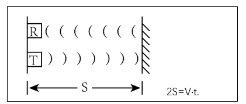
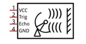

##############################################################################
Chapter 2 Ultrasonic Obstacle Avoidance Robot
##############################################################################

In this chapter, the robot will achieve the function of ultrasonic ostabcle avoidance. 

Ultrasonic Module
*********************************

Replace the ultrasonic module.
=================================

Step 1 Connect the ultrasonic module and the LED matrix module. It is important that the modules be connected in line with the silkprint of the pins.

+--------+-----+------+------+-----+
| Module | Gnd | Echo | Trig | Vcc |
+========+=====+======+======+=====+
|        | GND | ECHO | TRIG | VCC |
+ Robot  +-----+------+------+-----+
|        | GND | 8    | 9    | VCC |
+--------+-----+------+------+-----+

Ultrasonic Module
===================================

The ultrasonic ranging module uses the principle that ultrasonic waves will be sent back when encounter obstacles. We can measure the distance by counting the time interval between sending and receiving of the ultrasonic waves, and the time difference is the total time of the ultrasonic wave’s journey from being transmitted to being received. Because the speed of sound in air is a constant, about v=340m/s, we can calculate the distance between the ultrasonic ranging module and the obstacle: s=vt/2.

The ultrasonic ranging module integrates both an ultrasonic transmitter and a receiver. The transmitter is used to convert electrical signals (electrical energy) into high frequency (beyond human hearing) sound waves (mechanical energy) and the function of the receiver is opposite of this. The picture and the diagram of the ultrasonic ranging module are shown below: 

.. list-table::
    :align: center

    * - |Ultrasonic02|
      - |Ultrasonic03| 

.. |Ultrasonic02| image:: ../_static/imgs/2_Ultrasonic_Obstacle_Avoidance_Robot/Ultrasonic02.png

Pin description:

.. list-table::
    :align: center
    :header-rows: 1

    * - Pin
      - Description

    * - VCC
      - Power supply pin

    * - Trig
      - Trigger pin

    * - Echo
      - Echo pin

    * - GND
      - GND

Technical specs:

- Working voltage: 5V                                

- Working current: 12mA

- Minimum measured distance: 2cm          

- Maximum measured distance: 200cm

Instructions for use: output a high-level pulse in Trig pin lasting for least 10us, the module begins to transmit ultrasonic waves. At the same time, the Echo pin is pulled up. When the module receives the returned ultrasonic waves from encountering an obstacle, the Echo pin will be pulled down. The duration of high level in the Echo pin is the total time of the ultrasonic wave from transmitting to receiving, s=vt/2. 

Schematic
====================================

The ultrasonic module is plugged in the front of the car and is connected to the Raspberry Pi Pico (W) development board by means of wiring. As can be seen from the figure below, Raspberry Pi Pico (W) uses GPIO8 and GPIO9 to control the Trig and Echo pins of the ultrasonic module.

Sketch

Turn ON the power switch of the robot, after the ultrasonic sensor finishes initialization, obtain and print the ultrasonic data on the serial monitor.

Open the folder “02.1_Ultrasonic_Ranging” in 

“ **Freenove_Bipedal_Robot_Kit_for_Raspberry_Pi_Pico\\Sketches** ” 

and double click “02.1_Ultrasonic_Ranging.ino”

Code
-------------------------------------

.. literalinclude:: ../../../freenove_Kit/Sketches/02.1_Ultrasonic_Ranging/02.1_Ultrasonic_Ranging.ino
    :linenos:
    :language: cpp
    :dedent:

Code Explanation
-------------------------------------

Initialize ultrasonic module.

.. literalinclude:: ../../../freenove_Kit/Sketches/02.1_Ultrasonic_Ranging/02.1_Ultrasonic_Ranging.ino
    :linenos:
    :language: cpp
    :lines: 12-12
    :dedent:

Obtain the distance between ultrasonic module and the obstacle and return a real number data in cm.

.. code-block:: cpp
    :linenos:
    
    Get_Sonar()

Obtain and print the ultrasonic data via the serial port, which is updated every 0.5 seconds.

.. literalinclude:: ../../../freenove_Kit/Sketches/02.1_Ultrasonic_Ranging/02.1_Ultrasonic_Ranging.ino
    :linenos:
    :language: cpp
    :lines: 17-18
    :dedent:

Click “Upload” to upload the code to Raspberry Pi Pico (W). After uploading successfully, open Serial Monitor.

Set the baud rate as 115200. 

Obstacle Avoidance Robot
*******************************************************

After the robot activates, the ultrasonic module collects data between it and the obstacles in the front. Then make judgements according to the data and control the robot to avoid the obstacles.

Sketch
======================================================

Open the folder “02.2_Ultrasonic_Ranging_Robot”in 

“ **Freenove_Bipedal_Robot_Kit_for_Raspberry_Pi_Pico\\Sketches** ” and double click 

“02.2_Ultrasonic_Ranging_Robot.ino”.

Code
------------------------------------------------------

.. literalinclude:: ../../../freenove_Kit/Sketches/02.2_Ultrasonic_Ranging_Robot/02.2_Ultrasonic_Ranging_Robot.ino
    :linenos:
    :language: cpp
    :dedent:

Code Explanation
------------------------------------------------------

Check whether there is any obstacle in front of the robot with the ultrasonic wave. When the distance between the robot and the obstacles is smaller than the set number, the robot move backwards and turn left to avoid the obstacle.

.. literalinclude:: ../../../freenove_Kit/Sketches/02.2_Ultrasonic_Ranging_Robot/02.2_Ultrasonic_Ranging_Robot.ino
    :linenos:
    :language: cpp
    :lines: 39-47
    :dedent: