##############################################################################
Sing and Dance
##############################################################################

Playing Music
**************************

In this chapter, we use the speaker to play a piece of music. Please note that to play the music, it requires the use of file system. The raspberry pi pico (W) has built-in 264KB SRAM and 2MB of onboard flash, and the Arduino-Pico core supports using some of the onboard flash as a file system, useful for storing configuration data, output strings, logging, and more. It also supports using SD cards as another (FAT32) filesystem, with an API that’s compatible with the onboard flash file system.

The following diagram shows the flash layout used in Arduino-Pico:

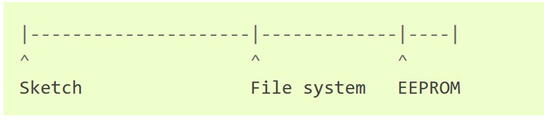

The storage of the raspberry pi pico (W) file system can be configured via the Arduino IDE menu bar, ranging from 0KB to 1MB.

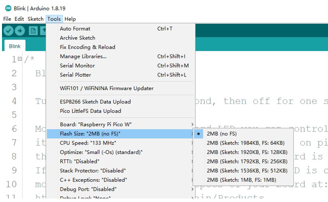

Due to the limitation of the storge, the file uploaded to pico (W) should not exceed 1024Kb (1M). Therefore, we need to restrict the file scale; otherwise, it may fail to upload.

Upload the file to LittleFS file system.

LittleFS is an onboard file system that sets aside some program flash memory for use as a file system, without requiring any external hardware.

It is also a tool integrated into the Arduino IDE, adding an item to the Tools menu for uploading the contents of a sketch data directory to a new LittleFS flash file system.

Installing PicoLittleFS Tool
==================================

The steps to install PicoLittleFS tools are as follows:

First, open the Arduino IDE, and then click File in Menus and select Preferences.

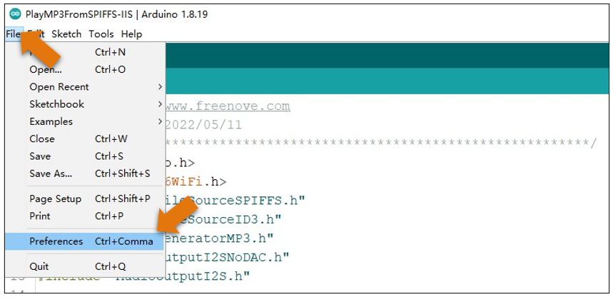

Find the Arduino IDE environment directory location.

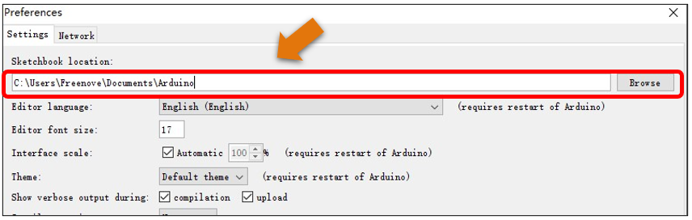

Copy the tools folder in the code folder to your Sketchbook location.

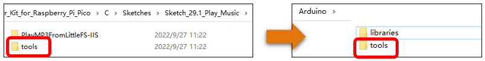

Finally, restart the Arduino IDE. After restarting, you can see that the plug-in already exists in the interface.

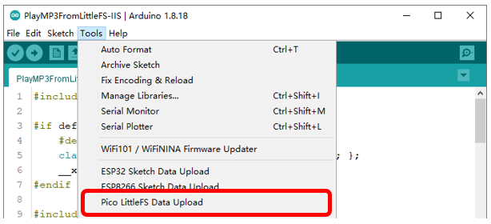

Upload music
--------------------------------

Pico of Raspberry Pie has 2M Flash space. Generally, Arduino mode allocates it to the code area. Therefore, before starting, we need to modify the configuration of Flash Size.

Open Arduino, select Tools from the menu bar, select Flash Size, and allocate 1MB of Flash space to store codes and 1MB to store audio files.

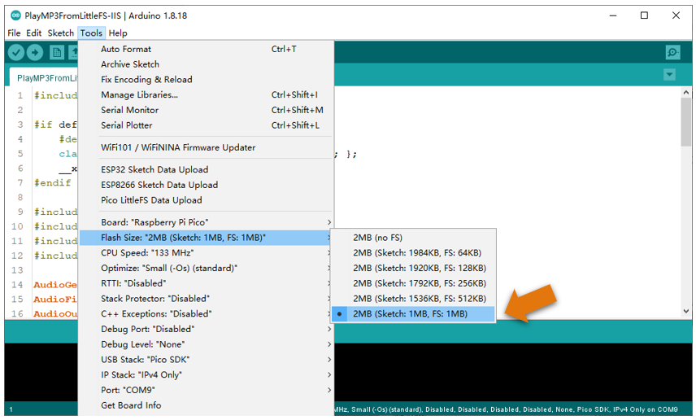

Make sure the CPU Speed of Raspberry Pi pico is 133Mhz. If the frequency is too low, the audio decoding speed may be too slow and the audio playback may not be continuous.

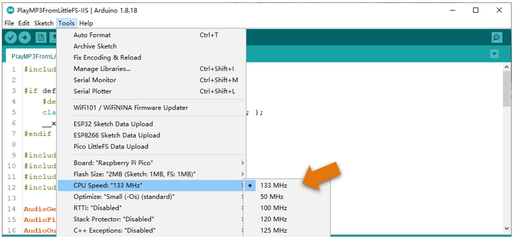

Check the code file and audio file. We create a folder named data under the same level directory of the code file, and place the audio file directly in this folder.

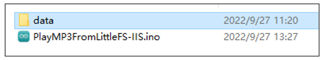

.. note::

    1. The name of the data folder cannot be changed, otherwise the plug-in cannot be used to upload audio files to Pico.

    2. The number of audio files in the data folder is unlimited, but the total size cannot exceed 1MB. If the file upload fails, please check whether the data folder size exceeds the range.

Click Arduino IDE Tools and click following content:

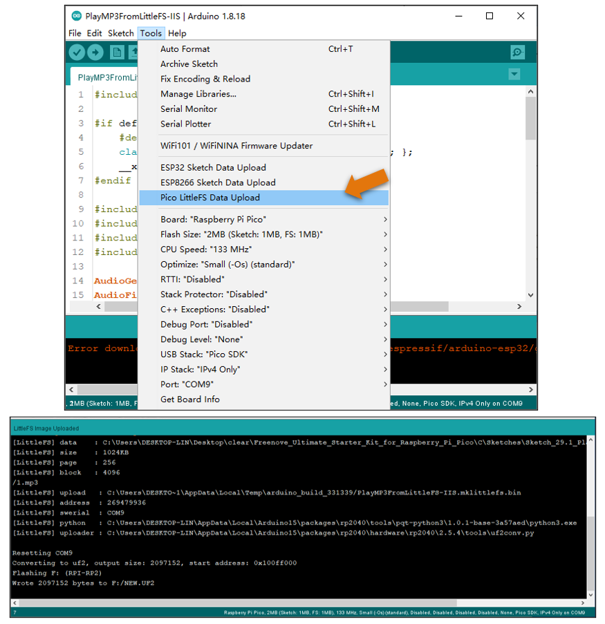

After uploading the music, click the upload button to upload the code to Pico.

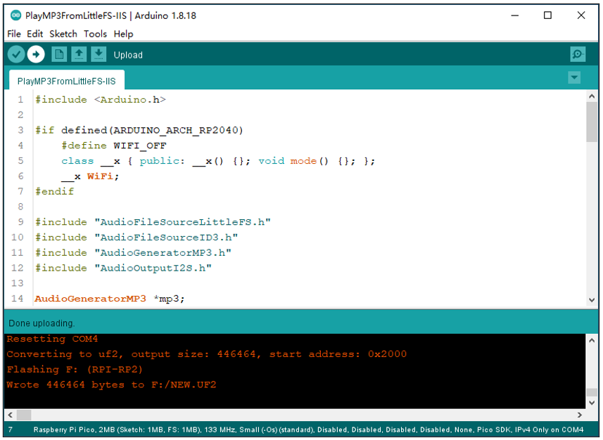

After the code upload is completed, the speaker will play the audio file you uploaded.

Sketch
===================================

Open the folder “03.1_Music” in “ **Freenove_Bipedal_Robot_Kit_for_Raspberry_Pi_Pico\\Sketches** ” and double click “03.1_Music.ino.ino”

The sketch is the same as 01.3.2_Music.ino. Now, let's upload the code to Pico (W) to play the music.

Code
-----------------------------------

.. literalinclude:: ../../../freenove_Kit/Sketches/03.1_Music/03.1_Music.ino
    :linenos:
    :language: cpp
    :dedent:

Sing and dance
*********************************

In this chapter, we will have the robot sing while dancing.

Sketch
=================================

Upload the code and you will get a robot that is singing while dancing.

Open the folder “03.2_Photosensitive_Car” in 

“ **Freenove_Bipedal_Robot_Kit_for_Raspberry_Pi_Pico\\Sketches** ” and double click 

“03.2_Sing_and_dance.ino”

Code
----------------------------------

.. literalinclude:: ../../../freenove_Kit/Sketches/03.2_Sing_and_dance/03.2_Sing_and_dance.ino
    :linenos:
    :language: cpp
    :dedent:

Code Explanation
----------------------------------

The Raspberry Pi pico (W) is equipped with a dual-core ARM Cortex M0+ processor. Core 0 is used to run the robot's dancing movements, and core 1 is for music playback. The two cores are independent and do not affect each other when running code.

.. literalinclude:: ../../../freenove_Kit/Sketches/03.2_Sing_and_dance/03.2_Sing_and_dance.ino
    :linenos:
    :language: cpp
    :lines: 110-112, 119-121
    :dedent: