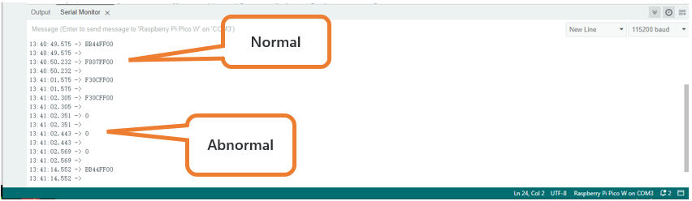
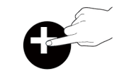
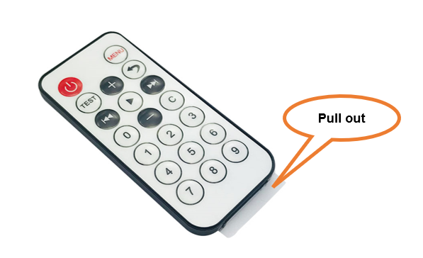

##############################################################################
Chapter 4 Infrared Robot
##############################################################################

Introduction of infrared reception function
******************************************************************************

Infrared Remote
===============================================================================

An infrared (IR) remote control is a device with a certain number of buttons. Pressing down different buttons will make the infrared emission tube, which is located in the front of the remote control, send infrared ray with different command. Infrared remote control technology is widely used in electronic products such as TV, air conditioning, etc. Thus making it possible for you to switch TV programs and adjust the temperature of the air conditioning when away from them. The remote control we use is shown below:

Infrared receiver
-----------------------------------

An infrared (IR) receiver is a component which can receive the infrared light, so we can use it to detect the signal emitted by the infrared remote control. DATA pin here outputs the received infrared signal.

When you use the infrared remote control, the infrared remote control sends a key value to the receiving circuit according to the pressed keys. We can program the Raspberry Pi Pico W to do things like lighting, when a key value is received. 

The following is the key value that the receiving circuit will receive when each key of the infrared remote control is pressed.

.. image:: ../_static/imgs/4_Infrared_Robot/Infrared02.png
    :align: center

Install IRremote library
==================================

In this project, we use a third-party library named **IRremote**. Please install it first.

Open Arduino IDE, click **Library Manage** on the left, and search **“IRremote”** to install.

It is recommended to use version **4.4.1** of the IRremote library to avoid compatibility issues.

.. image:: ../_static/imgs/4_Infrared_Robot/Infrared15.png
    :align: center

The second way, open Arduino IDE, click Sketch -> Include Library -> Add .ZIP Library. In the pop-up window, find the file named **“./Libraries/ IRremote_V4.4.1_20241029.Zip”** which locates in this directory, and click OPEN.

.. image:: ../_static/imgs/4_Infrared_Robot/Infrared16.png
    :align: center

Sketch
==================================

Each time when you press the infrared remote control, the car will print the received infrared coding value through serial port. 

Open the folder “04.1_IR_Receiver”in 

“ **Freenove_Robot_Kit_for_Raspberry_Pi_Pico\\Ordinary_wheels\\Sketches** ” and double click 

“04.1_IR_Receiver.ino”.

.. image:: ../_static/imgs/4_Infrared_Robot/Infrared17.png
    :align: center

Code
--------------------------------

.. literalinclude:: ../../../freenove_Kit/Sketches/04.1_IR_Receiver/04.1_IR_Receiver.ino
    :linenos:
    :language: cpp
    :dedent:

Download the code to Raspberry Pi Pico (W), open the serial port monitor and set the baud rate to 115200. Press any keys on the IR remote and their corresponding values will be printed out through the serial port. As shown in the following figure: (Note that if the remote control button is long pressed, the infrared receiving circuit receives a "0".)

First, include header file. Each time you use the infrared sensor, you need to include the header file at the beginning of the program.

.. literalinclude:: ../../../freenove_Kit/Sketches/04.1_IR_Receiver/04.1_IR_Receiver.ino
    :linenos:
    :language: cpp
    :lines: 7-7
    :dedent:

Second, define an infrared receive pin and the infrared sensor is initialized.

.. code-block:: cpp
    :linenos:

    #define IR_Pin 3                      // Infrared receiving pin
    ...
    IrReceiver.begin(IR_Pin, DISABLE_LED_FEEDBACK);  // Start the receiver

Finally, **IrReceiver.decode()** is used to determine whether an infrared signal has been received, returning true/1 if an infrared signal has been received, or false/0 if no infrared signal has been received;  If an infrared signal is received, the received infrared coded value is printed through the serial port. 

Please note that **IrReceiver.resume()** must be applied to release the infrared receiver function each time  data are received. Otherwise, the infrared receiver function can only be used once and data cannot be received next time.

.. literalinclude:: ../../../freenove_Kit/Sketches/04.1_IR_Receiver/04.1_IR_Receiver.ino
    :linenos:
    :language: cpp
    :lines: 19-23
    :dedent:

4.2 Infrared Robot
*********************************

On the basis of the previous section, we further controls the robot via the infrared remote controller. Press the black buttons on the remote, the robot will move forward, move backward, turn left and turn right accordingly. Press other buttons will stop the robot.

Sketch
==================================

Open the folder “04.2_IR_Receiver_Robot” in the 

“ **Freenove_Bipedal_Robot_Kit_for_Raspberry_Pi_Pico\\Sketches** ” and double click “04.2_IR_Receiver_Robot.ino”.

Code
-----------------------------------

.. literalinclude:: ../../../freenove_Kit/Sketches/04.2_IR_Receiver_Robot/04.2_IR_Receiver_Robot.ino
    :linenos:
    :language: cpp
    :dedent:

Compile and upload the code to Raspberry Pi Pico (W).  When pressing "0" of the infrared remote control, the expression module will randomly display the content dynamically.

.. list-table::
   :align: center

   * - |Infrared04|
     - |Infrared08|
     - **Move forward**
   
   * - |Infrared05|
     - |Infrared09|
     - **Turn left**
   
   * - |Infrared06|
     - |Infrared10|
     - **Turn right**
   
   * - |Infrared07|
     - |Infrared11|
     - **Move back**

.. |Infrared09| image:: ../_static/imgs/4_Infrared_Robot/Infrared09.png

Code Explanation:
----------------------------------

Variable **IrReceiver.DecodedIRData.DecodedRawData** holds the infrared remote control encoding information; call handleccontrol function performs different code value corresponding action.  

After each execution of the program, call the **IrReceiver.resume()** function to release the infrared pin.  If you do not call this function, you cannot use the infrared receiving and decoding functions again.

.. literalinclude:: ../../../freenove_Kit/Sketches/04.2_IR_Receiver_Robot/04.2_IR_Receiver_Robot.ino
    :linenos:
    :language: cpp
    :lines: 50-59
    :dedent:

Infrared key code value processing function, receives instructions sent by the infrared remote control, and execute the corresponding program.

.. code-block:: cpp
    :linenos:

    void handleControl(unsigned long value) {
        // Handle the commands
        switch (value) { 
            case 0xBF40FF00:  // Receive the number '+'
            ...
            case 0xE619FF00:  // Receive the number '-'
            ...
            case 0xF807FF00:  // Receive the number '|<<'
            ...
            case 0xF609FF00:  // Receive the number '>>|'
            ...
            case 0xE916FF00:  // Receive the number '0'
            ...
            default:        // Control the car to stop moving
            ...
        }
    }

Multi-Functional Infrared Robot
*******************************************************

Now we integrated other functions to the infrared remote, so that most functions of the robot can be controlled via the infrared remote.

Sketch
=======================================================

Open the folder “04.3_Multi_Functional_Robot” in the “Freenove_Bipedal_Robot_Kit_for_Raspberry_Pi_Pico\\Sketches” and double click “04.3_Multi_Functional_Robot.ino”.

code
---------------------------------------------------------

.. literalinclude:: ../../../freenove_Kit/Sketches/04.3_Multi_Functional_Robot/04.3_Multi_Functional_Robot.ino
    :linenos:
    :language: cpp
    :dedent:

After the code uploads successfully, turn on the power of the car and use the infrared remote to control the car and other functions. The corresponding keys and their functions are shown in the following table:

Code Explanation:
----------------------------------

Add the header file for the robot.

.. literalinclude:: ../../../freenove_Kit/Sketches/04.3_Multi_Functional_Robot/04.3_Multi_Functional_Robot.ino
    :linenos:
    :language: cpp
    :lines: 7-15
    :dedent:

Infrared key code value processing function receives instructions sent by the infrared remote control and execute the corresponding program.

.. code-block:: cpp
    :linenos:

    void handleControl(unsigned long value) {
    // Handle the commands
        switch (value) {
            case 0xBF40FF00:  // Receive the number '+'
            ...
            case 0xE619FF00:  // Receive the number '-'
            ...
            case 0xF807FF00:  // Receive the number '|<<'
            ...
            case 0xF609FF00:  // Receive the number '>>|'
            ...
            case 0xEA15FF00:  // Receive the number '▶'
            ...
            case 0xE916FF00:  // Receive the number '0'
            ...
            case 0xF30CFF00:  // Receive the number '1'
            ...
            case 0xF708FF00:  // Receive the number '4'
            ...
            case 0xF20DFF00:  // Receive the number 'C'
            ...
            case 0xA15EFF00:  // Receive the number '3'
            ...
            case 0xA55AFF00:  // Receive the number '6'
            ...
            case 0xB54AFF00:  // Receive the number '9'
            ...
            case 0xBB44FF00:  // Receive the number 'TEST'
            ...
            case 0xE718FF00:  // Receive the number '2'
            ...
            case 0xE31CFF00:  // Receive the number '5'
            ...
            case 0xBD42FF00:  // Receive the number '7'
            ...
            case 0xAD52FF00:  // Receive the number '8'
            ...
            case 0xFFFFFFFF:  // Remain unchanged
            break;
            default:
            break;
        }
    }

Sketch 04.4_Multi_Functional_Robot.ino is almost the same as 04.3_Multi_Functional_Robot.ino, except that it is added with the music play function. You can find the function of each key in the table below.

