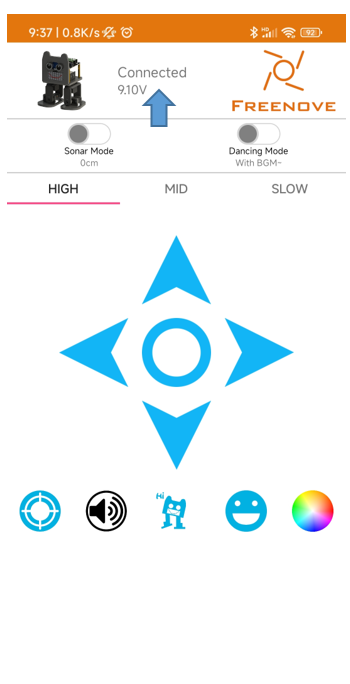

##############################################################################
Bluetooth remote control robot
##############################################################################

**This section requires an Android or iPhone device with Bluetooth to control the robot.** 

**If you have any concerns, please feel free to contact us via** support@freenove.com

Bluetooth Sending and Receiving Data
*******************************************************************************

Bluetooth Module
===============================================================================

The Bluetooth module is a serial port transparent transmission module that supports Bluetooth Low Energy (BLE).

It has such advantages as small size, high performance, high-cost performance, low power consumption, and strong platform compatibility. The Bluetooth module we use is as shown below:

Install Freenove app
================================================================================

There are three ways to install our app. 

Method 1
---------------------------------------------------------------------------------

Use Google play to search “Freenove”, download and install.

Method 2
---------------------------------------------------------------------------------

Visit https://play.google.com/store/apps/details?id=com.freenove.suhayl.Freenove, and click install.

.. image:: ../_static/imgs/5_Bluetooth_remote_control_robot/Bluetooth02.png
    :align: center

Method 3
---------------------------------------------------------------------------------

Visit https://github.com/Freenove/Freenove_app_for_Android, download the files in this library, and install freenove.apk to your Android phone manually. 

Instructions for Using the Bluetooth Module
==================================================================================

The Bluetooth module communicates with the Raspberry Pi Pico (W) through serial port, and the program is also uploaded to Pico (W) via the serial port. :red:`Therefore, when uploading code to pico (W), if it fails, please remove the Bluetooth module and upload again.`

When the Bluetooth module is not connected by other device, it can be configured using the AT command. Once connected, the Bluetooth module acts as a data pipe and cannot be configured.

By default, the Bluetooth module has a baud rate of 115200, no parity, 8 data bits, and 1 stop bit. Bluetooth name "BT05", role mode is slave mode.

Set name of bluetooth
-----------------------

If you have multiple Bluetooth modules with the same name around you, you will be confused when you connect. Which one is the Bluetooth module I want to connect to?

In the next project, we will introduce how to use the AT command to modify the name of the Bluetooth module and the master-slave role in the program.

For AT commands and more information about the Bluetooth module, refer to the documentation in the package for Datasheets/BT05-Instruction.pdf

This project uses the AT command to make some settings for the Bluetooth module, then uses the Bluetooth module to receive data from the app and print the data on the serial monitor.

Menu
----------------------

Open application “Freenove”, as shown below:

Introduction to the APP
================================

In this chapter, we use the Freenove Bipedal robot for Raspberry Pi Pico (W) in the app, so let’s learn its interface first, as shown below:

Sketch
=========================

Open “05.1_Bluetooth_Robot” in “ **Freenove_Bipedal_Robot_Kit_for_Raspberry_Pi_Pico\\Sketches** ” and double click “05.1_Bluetooth_Robot.ino”.

Note: if the code fails to upload, please remove the Bluetooth and upload it again.

After the code is successfully uploaded, follow the steps below.

1.	Plug the Bluetooth module to thecar as shown below. Don't reverse it. The wrong connection may damage your hardware.

2.	Open Arduino Serial Monitor, and reset the control board.

As shown in the figure below, the Bluetooth name is set to “BT05” and the Bluetooth mode is slave mode (ROLE=0).

.. image:: ../_static/imgs/5_Bluetooth_remote_control_robot/Bluetooth07.png
    :align: center

Next, open Freenove APP, tap e Freenove Bipedal Robot for Raspberry Pi Pico.

Click the following icon.

Click BT05.

If the connection successes, you can see “Connected”.

Operate the app, and observe the monitor.

The monitor will show contents as below:

Bluetooth data- robot action

The command format for communication between app and robot is A#xxx#xxx#...xxx#, where # is a separator, the first character A represents the action command, it can be other characters, such as B, C, D…The xxx represents the parameters of the action command. And different commands carry different parameters. The command list is as below:

.. list-table::
    :align: center
    :header-rows: 1

    * - Action command
      - Description
      - Command character
      - Number of parameters 
       
        (app send/receive)
      - Format example 
    
        (app send/receive)
    
    * - MOVE
      - Under the MOVE mode, 
        
        parameter 1 represents the movement mode, and 
        
        parameter 2 indicates the moving speed.
      - A
      - 2
      - A#100#100#
    
    * - VOLTAGE
      - Get the batteries voltage, 
       
        parameter is the voltage value, unit mV
      - P
      - 0/1
      - P# /P#4100#
    
    * - LED_RGB
      - Control RGBLED, parameters respectively are 
       
        serial number of LED mode, 
       
        red value, green value, blue value.
      - C
      - 4
      - C#2#100#150#200#
    
    * - BUZZER
      - Control buzzer, and parameter is the frequency.
      - D
      - 1
      - D#2000#

Code
-------------

.. literalinclude:: ../../../freenove_Kit/Sketches/05.1_Bluetooth_Robot/05.1_Bluetooth_Robot.ino
    :linenos:
    :language: cpp
    :dedent:

Uplode the code to Raspberry Pi Pico W car and open serial monitor.

.. image:: ../_static/imgs/5_Bluetooth_remote_control_robot/Bluetooth13.png
    :align: center

Open Freenove app, and tap the bipedal robot for Raspberry Pi Pico (W).

.. image:: ../_static/imgs/5_Bluetooth_remote_control_robot/Bluetooth14.png
    :align: center

Code Explanation
------------------

Configure Bluetooth, set the Bluetooth name, baud rate and other parameters.

.. literalinclude:: ../../../freenove_Kit/Sketches/05.1_Bluetooth_Robot/05.1_Bluetooth_Robot.ino
    :linenos:
    :language: cpp
    :lines: 26-43
    :dedent:

After the Bluetooth module connects successfully, print the data it receives.

.. literalinclude:: ../../../freenove_Kit/Sketches/05.1_Bluetooth_Robot/05.1_Bluetooth_Robot.ino
    :linenos:
    :language: cpp
    :lines: 54-70
    :dedent:

Bluetooth Remote Robot
**********************************

In the previous section, we have learned how to receive the data of the app via Bluetooth, and the meanings of the data format. Next, let’s use the data to control the robot to make some basic movements, like moving forward and backward, turning left and right, etc.

Sketch
=================================

Open the folder “05.2_Bluetooth_Remote_Robot” in 

**Freenove_Bipedal_Robot_Kit_for_Raspberry_Pi_Pico\\Sketches and double click** “05.2_Bluetooth_Remote_Robot.ino”.

As mentioned above, connect the APP to the ribot via Bluetooth, and then control the robot by taping or sliding the opration panel on the APP.

Code
---------------------------------

.. literalinclude:: ../../../freenove_Kit/Sketches/05.2_Bluetooth_Remote_Robot/05.2_Bluetooth_Remote_Robot.ino
    :linenos:
    :language: cpp
    :dedent:

Code Explanation
--------------------

Add the header files to drive the robot.

.. literalinclude:: ../../../freenove_Kit/Sketches/05.2_Bluetooth_Remote_Robot/05.2_Bluetooth_Remote_Robot.ino
    :linenos:
    :language: cpp
    :lines: 20-25
    :dedent:

Upon receiving movement commands, the robot makes corresponfing actions.

.. literalinclude:: ../../../freenove_Kit/Sketches/05.2_Bluetooth_Remote_Robot/05.2_Bluetooth_Remote_Robot.ino
    :linenos:
    :language: cpp
    :lines: 101-123
    :dedent:

Multifunctional Bluetooth Remote Robot
***************************************

In this section, we add more functions to the robot based on the previous section, making the robot more interested. The main functions include automatic obstacle avoidance, audio playing, LED displaying, and expressions on LED dot matrix. 

Upload Code and Running
===========================

Connect the robot to your computer with the USB cable.

As this section involves the audio playing function, please upload the audio data to the Raspberry Pi Pico (W) before uploading sketch. You can find the detailed steps :ref:`here <upload_music>`.

After uploading the audio file, you can upload sketch 05.3_Multi_Functional_Robot to the robot.

If the code fails to upload, please remove the Bluetooth module and upload again. Reconnect the Bluetooth module after the code uploads successfully. 

After the code is successfully uploaded, unplug the USB cable and plug the Bluetooth module to the robot. Turn on the robot power switch.

Connect the APP with the robot through Bluetooth. Tap or swipe the operation panels on the app to control the robot’s movements. The color palette of the lower right corner can be clicked to control the display mode and color of the LED. Among them,

Mode 0 is a flowing rainbow,

Mode 1 is a flowing water LED with color changing.

Mode 2 is a color-adjustable Blink.

Mode 3 displays the selected color of the current color picker for all LEDs.

Code
===========================

On the basis of the previous sketch, this one is added with more interesting functions.

Multi_Functional_Robot
-----------------------------

.. literalinclude:: ../../../freenove_Kit/Sketches/05.3_Multi_Functional_Robot/05.3_Multi_Functional_Robot.ino
    :linenos:
    :language: cpp
    :dedent:

Same as in the previous project, when the corresponding command is received by Bluetooth, the corresponding function is executed.

.. literalinclude:: ../../../freenove_Kit/Sketches/05.3_Multi_Functional_Robot/05.3_Multi_Functional_Robot.ino
    :linenos:
    :language: cpp
    :lines: 500-518
    :dedent:

The decription of the commands and their functions are as shwon in the table below:

.. list-table::
    :align: center

    * - Commands
      - Description
    
    * - A#parm1#parm2
      - Controls the robot's movements.
    
    * - B#parm1
      - Expressions control command
    
    * - C#parm1#parm2#parm3#parm4
      - RGB LEDs control command
    
    * - D#parm1
      - Buzzer control command
    
    * - Send battery data every 25s
      - Send the battery level to the APP. 
       
        Format: P#Battery voltage
    
    * - M#parm1
      - Audio playing command

    * - H#parm1
      - Ultrasonic obstacle avoidanve mode 
       
        or dance mode

    * - Send distance data under the obstacle avoidance mode
      - Send the ultrasonic data to the APP. 
       
        Format: E# ultrasonic data