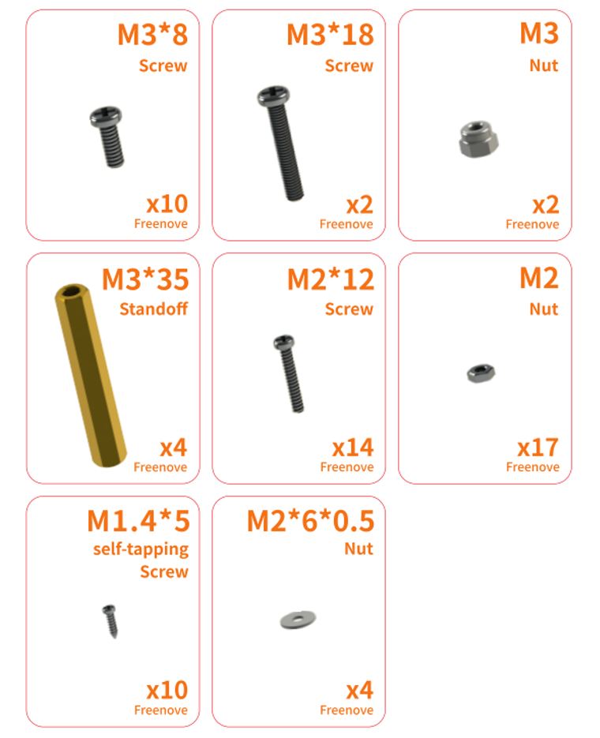

##############################################################################
List
##############################################################################

If you have any concerns, please feel free to contact us via support@freenove.com

Raspberry Pi Pico (W) Robot Shield
************************************************************

.. list-table::
   :header-rows: 1

   * - Top
     - Bottom
   
   * - |List00|
     - |List01|

Machinery Parts
************************************************************

Acrylic Parts
************************************************************

Electronic Parts
************************************************************

+----------------------+------------------------------+
| Dot Matrix Module x1 | Ultrasonic Module x1         |
|                      |                              |
| |List04|             | |List05|                     |
|                      +------------------------------+
|                      | Speaker x1                   |
|                      |                              |
|                      | |List06|                     |
+----------------------+------------------------------+
| Servo package x4                                    |
|                                                     |
| |List07|                                            |
+----------------------+------------------------------+
| Bluetooth module x1  | Infrared emitter x1          |
|                      |                              |
| |List08|             | |List09|                     |
+----------------------+------------------------------+
| Raspberry Pi Pico W x1 or Raspberry Pi Pico x1      |
|                                                     |
| |List10|                                            |
+-----------------------------------------------------+

:red:`If you bought the kit without control board, please prepare one of the above board yourself.`

Wires
************************************************************

Jumper Wire F/F(4 pin) x2

Tools
************************************************************

.. list-table::

   * - Cross screwdriver (3mm) x1
     - Cross screwdriver (2mm) x1
   
   * - |List12|
     - |List13|

   * - Cable Tidy x40cm
     - M3 spanner 

   * - |List14|
     - |List15|

Required but NOT Contained Parts
************************************************************

This robot is powered with :red:`9V alkaline batteries` or :red:`9V NIMH rechargeable batteries` as power supply.

Please note that 9V carbon batteries and 9V rechargeable lithium batteries **cannot** provide enough power for the robot. Therefore, it is important to pay attention to the battery model when purchasing batteries.

It is easy to find appropriate batteries on both eBay and Amazon. You can simply search 9V battery 6lr61 or 9V rechargeable NIMH battery on the platforms.

