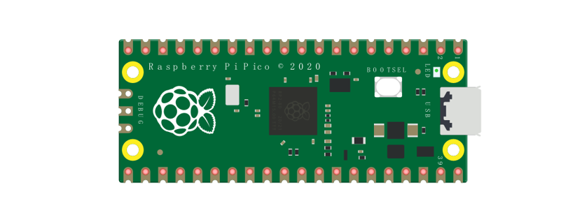
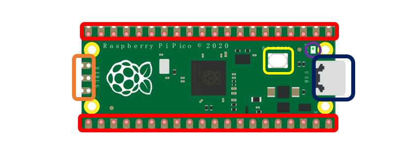
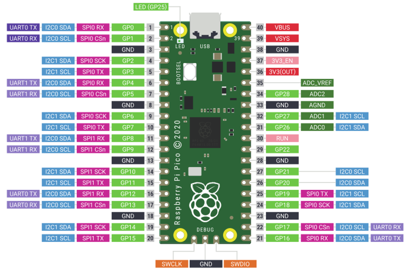
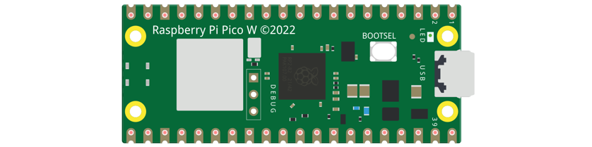
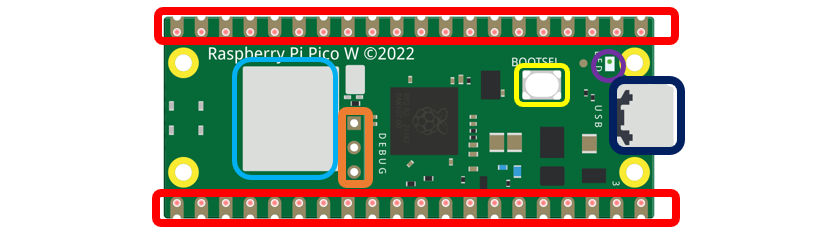
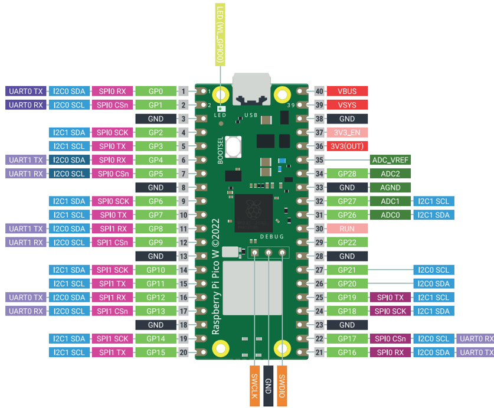
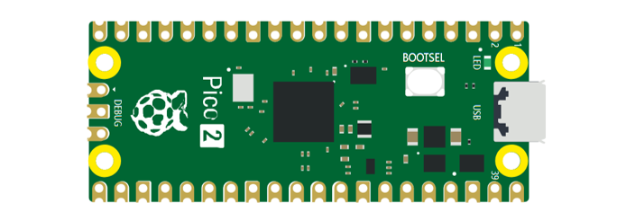
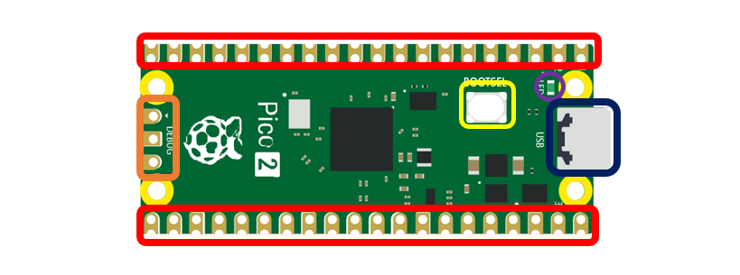
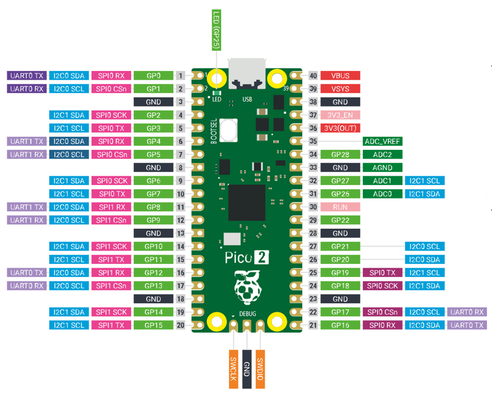
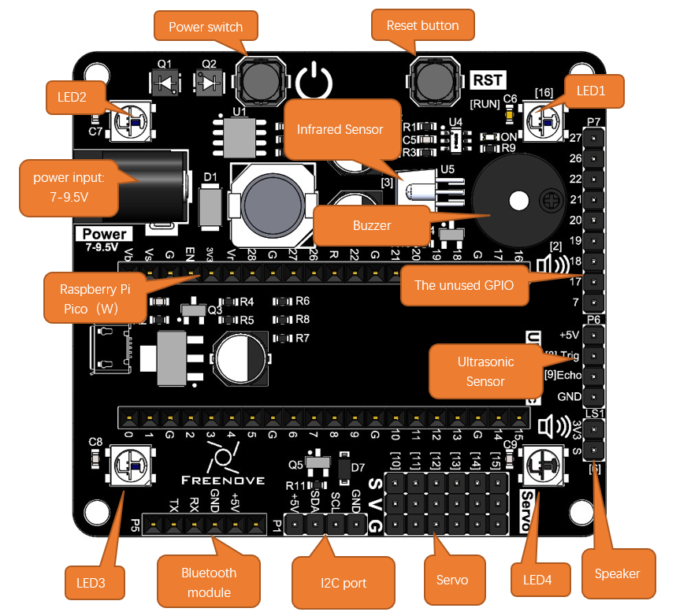

##############################################################################
Preface
##############################################################################

Welcome to use Freenove Bipedal Robot Kit for Raspberry Pi Pico (W). Following this tutorial, you can make a very cool robot with many functions. 

Based on the Raspberry Pi Pico (W) development board, a popular IoT control board, this kit uses the very popular Arduino IDE for programming, so you can share and exchange your experience and design ideas with enthusiasts all over the world. The parts in the kit include all electronic components, modules, and mechanical components required for making the robot. They are all individually packaged. There are detailed assembly and debugging instructions in this book. If you encounter any problems, please feel free to contact us for fast and free technical support.

support@freenove.com 

This robot does not require a high threshold for users. Even if you know little professional knowledge, you can make your own smart robot easily with the guidance of the tutorial. If you're really interested in Raspberry Pi Pico (W) and hope to learn how to program and build circuits, please visit our website: `www.freenove.com <www.freenove.com>`_ or contact us to buy our kit designed for beginners: :red:`Freenove Ultimate Kit for Raspberry Pi Pico`.

Raspberry Pi Pico
*********************************

:red:`Raspberry Pi Pico applies to all chapters except Wireless in this tutorial.`

Before learning Pico, we need to know about it. Below is an imitated diagram of Pico, which looks very similar to the actual Pico.

The hardware interfaces are distributed as follows:

.. list-table:: 
   :width: 100%
   :header-rows: 1 
   :align: center
   
   * -  Frame color
     -  Description

   * -  |Preface02|
     -  Pins

   * -  |Preface03|
     -  BOOTSE button

   * -  |Preface04|
     -  USB port

   * -  |Preface05|
     -  LED

   * -  |Preface06|
     -  Debugging

Function definition of pins:

.. list-table:: 
   :width: 100%
   :header-rows: 1 
   :align: center
   
   * -  Color
     -  Pins
     -  Color
     -  Pins

   * -  |Preface08|
     -  GND
     -  |Preface09|
     -  Power

   * -  |Preface10|
     -  GPIO
     -  |Preface11|
     -  ADC

   * -  |Preface12|
     -  UART(default)
     -  |Preface13|
     -  UART

   * -  |Preface14|
     -  SPI
     -  |Preface15|
     -  I2C

   * -  |Preface16|
     -  System Control
     -  |Preface17|
     -  Debugging

For details: https://datasheets.raspberrypi.org/pico/pico-datasheet.pdf

.. _defaultPin:

UART, I2C, SPI Default Pin
==============================================

In Arduino IDE, the default pins of serial port are Pin0 and Pin1. 

.. note:: 
    
    Serial port is virtualized by RP2040. Therefore, when using the serial port, please enable the verification function of DTR. It can work under any baud rate.

UART
----------------------------------------

.. list-table:: 
   :width: 100%
   :header-rows: 1 
   :align: center
   
   * -  Function
     -  Default
   
   * -  UART_BAUDRATE
     -  X

   * -  UART_BITS
     -  8

   * -  UART_STOP
     -  1

   * -  UART_TX
     -  Pin 0

   * -  UART_RX
     -  Pin 1

I2C
------------------------------

.. list-table:: 
   :width: 100%
   :header-rows: 1 
   :align: center
   
   * -  Function
     -  Default
   
   * -  I2C Frequency
     -  400000

   * -  I2C_SDA
     -  Pin 4

   * -  I2C_SCL
     -  Pin 5

SPI
------------------------------

.. list-table:: 
   :width: 100%
   :header-rows: 1 
   :align: center
   
   * -  Function
     -  Default
   
   * -  SPI_BAUDRATE
     -  1000000

   * -  SPI_POLARITY
     -  0

   * -  SPI_PHASE
     -  0

   * -  SPI_BITS
     -  8

   * -  SPI_FIRSTBIT
     -  MSB

   * -  SPI_SCK
     -  Pin 18

   * -  SPI_MOSI
     -  Pin 19

   * -  SPI_MISO
     -  Pin 16

   * -  SPI_SS
     -  Pin 17

Raspberry Pi Pico W
*************************************

:red:`Raspberry Pi Pico W applies to all chapters in this tutorial.`

Raspberry Pi Pico W adds CYW43439 as the WiFi function based on Raspberry Pi Pico. It is connected to RP2040 chip through SPI interface.

The hardware interfaces are distributed as follows:

.. list-table:: 
   :width: 100%
   :header-rows: 1 
   :align: center
   
   * -  Frame color
     -  Description

   * -  |Preface02|
     -  Pins

   * -  |Preface03|
     -  BOOTSE button

   * -  |Preface04|
     -  USB port

   * -  |Preface05|
     -  LED

   * -  |Preface06|
     -  Debugging

   * -  |Preface20|
     -  Wireless

Function definition of pins:

.. list-table:: 
   :width: 100%
   :header-rows: 1 
   :align: center
   
   * -  Color
     -  Pins
     -  Color
     -  Pins

   * -  |Preface08|
     -  GND
     -  |Preface09|
     -  Power

   * -  |Preface10|
     -  GPIO
     -  |Preface11|
     -  ADC

   * -  |Preface12|
     -  UART(default)
     -  |Preface13|
     -  UART

   * -  |Preface14|
     -  SPI
     -  |Preface22|
     -  I2C

   * -  |Preface16|
     -  System Control
     -  |Preface17|
     -  Debugging

For details: https://datasheets.raspberrypi.com/picow/pico-w-datasheet.pdf

UART, I2C, SPI Default Pin
==============================================

In Arduino IDE, the default pins of serial port are Pin0 and Pin1. 

.. note:: 
    
    Serial port is virtualized by RP2040. Therefore, when using the serial port, please enable the verification function of DTR. It can work under any baud rate.

UART
----------------------------------------

.. list-table:: 
   :width: 100%
   :header-rows: 1 
   :align: center
   
   * -  Function
     -  Default
   
   * -  UART_BAUDRATE
     -  X

   * -  UART_BITS
     -  8

   * -  UART_STOP
     -  1

   * -  UART_TX
     -  Pin 0

   * -  UART_RX
     -  Pin 1

I2C
------------------------------

.. list-table:: 
   :width: 100%
   :header-rows: 1 
   :align: center
   
   * -  Function
     -  Default
   
   * -  I2C Frequency
     -  400000

   * -  I2C_SDA
     -  Pin 4

   * -  I2C_SCL
     -  Pin 5

SPI
------------------------------

.. list-table:: 
   :width: 100%
   :header-rows: 1 
   :align: center
   
   * -  Function
     -  Default
   
   * -  SPI_BAUDRATE
     -  1000000

   * -  SPI_POLARITY
     -  0

   * -  SPI_PHASE
     -  0

   * -  SPI_BITS
     -  8

   * -  SPI_FIRSTBIT
     -  MSB

   * -  SPI_SCK
     -  Pin 18

   * -  SPI_MOSI
     -  Pin 19

   * -  SPI_MISO
     -  Pin 16

   * -  SPI_SS
     -  Pin 17

Wireless
----------------------------------------

.. list-table:: 
   :width: 100%
   :header-rows: 1 
   :align: center
   
   * -  Function
     -  Default
   
   * -  WL_ON
     -  GPIO23

   * -  WL_D
     -  GPIO24

   * -  WL_CLK
     -  GPIO29_ADC

   * -  WL_CS
     -  GPIO25

Raspberry Pi Pico 2
*****************************************

Raspberry Pi Pico 2 is applicable to all chapters in this tutorial except RFID and those involving WiFi. 

Raspberry Pi Pico 2 uses RP2350 chip as the main controller, which equipped with dual Cortex-M33 or Hazard3 processors, capable of running up to 150 MHz, providing a significant boost in processing power, compared with the original Pico. It also doubles the memory with 520KB of SRAM and 4MB of onboard flash memory, with the ADC sampling frequency increasing to up to 500ksps. In addition, it adds 8 more PWM channels, and features additional interfaces like 2× Timer with 4 alarms, 1× AON Timer and 4 x PIO.

The hardware interfaces are distributed as follows:

.. list-table:: 
   :width: 100%
   :header-rows: 1 
   :align: center
   
   * -  Frame color
     -  Description

   * -  |Preface02|
     -  Pins

   * -  |Preface03|
     -  BOOTSE button

   * -  |Preface04|
     -  USB port

   * -  |Preface05|
     -  LED

   * -  |Preface06|
     -  Debugging

Function definition of pins:

.. list-table:: 
   :width: 100%
   :header-rows: 1 
   :align: center
   
   * -  Color
     -  Pins
     -  Color
     -  Pins

   * -  |Preface08|
     -  GND
     -  |Preface09|
     -  Power

   * -  |Preface10|
     -  GPIO
     -  |Preface11|
     -  ADC

   * -  |Preface12|
     -  UART(default)
     -  |Preface13|
     -  UART

   * -  |Preface14|
     -  SPI
     -  |Preface22|
     -  I2C

   * -  |Preface16|
     -  System Control
     -  |Preface17|
     -  Debugging

For details: https://datasheets.raspberrypi.com/pico/pico-2-datasheet.pdf

UART, I2C, SPI Default Pin
==============================================

In Arduino IDE, the default pins of serial port are Pin0 and Pin1. 

.. note:: 
    
    Serial port is virtualized by RP2040. Therefore, when using the serial port, please enable the verification function of DTR. It can work under any baud rate.

UART
----------------------------------------

.. list-table:: 
   :width: 100%
   :header-rows: 1 
   :align: center
   
   * -  Function
     -  Default
   
   * -  UART_BAUDRATE
     -  X

   * -  UART_BITS
     -  8

   * -  UART_STOP
     -  1

   * -  UART_TX
     -  Pin 0

   * -  UART_RX
     -  Pin 1

I2C
------------------------------

.. list-table:: 
   :width: 100%
   :header-rows: 1 
   :align: center
   
   * -  Function
     -  Default
   
   * -  I2C Frequency
     -  400000

   * -  I2C_SDA
     -  Pin 4

   * -  I2C_SCL
     -  Pin 5

SPI
------------------------------

.. list-table:: 
   :width: 100%
   :header-rows: 1 
   :align: center
   
   * -  Function
     -  Default
   
   * -  SPI_BAUDRATE
     -  1000000

   * -  SPI_POLARITY
     -  0

   * -  SPI_PHASE
     -  0

   * -  SPI_BITS
     -  8

   * -  SPI_FIRSTBIT
     -  MSB

   * -  SPI_SCK
     -  Pin 18

   * -  SPI_MOSI
     -  Pin 19

   * -  SPI_MISO
     -  Pin 16

   * -  SPI_SS
     -  Pin 17

Pins of the Robot
*********************************************

To learn what each GPIO corresponds to, please refer to the following table.

The functions of the pins are allocated as follows:

+-----------------------------+------------------------+-------------+
| Pins of Raspberry Pi Pico W |        Funtions        | Description |
+=============================+========================+=============+
| GPIO10                      |                        | Servo1      |
+-----------------------------+                        +-------------+
| GPIO11                      |                        | Servo2      |
+-----------------------------+                        +-------------+
| GPIO12                      |                        | Servo3      |
+-----------------------------+ Servo                  +-------------+
| GPIO13                      |                        | Servo4      |
+-----------------------------+                        +-------------+
| GPIO14                      |                        | Servo5      |
+-----------------------------+                        +-------------+
| GPIO15                      |                        | Servo6      |
+-----------------------------+------------------------+-------------+
| GPIO8                       |                        | Trig        |
+-----------------------------+ Ultrasonic module      +-------------+
| GPIO9                       |                        | Echo        |
+-----------------------------+------------------------+-------------+
| GPIO4                       |                        | SDA         |
+-----------------------------+ I2C port               +-------------+
| GPIO5                       |                        | SCL         |
+-----------------------------+------------------------+-------------+
| GPIO16                      | WS2812                 | WS2812      |
+-----------------------------+------------------------+-------------+
| GPIO28                      | Battery detection      | A2          |
+-----------------------------+------------------------+-------------+
| GPIO6                       | Speaker interface      | Speaker     |
+-----------------------------+------------------------+-------------+
| GPIO3                       | Infrared receiver port | IR          |
+-----------------------------+------------------------+-------------+
| GPIO2                       | Buzzer port            | Buzzer      |
+-----------------------------+------------------------+-------------+
| GPIO1                       |                        | RX          |
+-----------------------------+ Bluetooth module       +-------------+
| GPIO0                       |                        | TX          |
+-----------------------------+------------------------+-------------+
| GPIO7                       |                        | GPIO7       |
+-----------------------------+                        +-------------+
| GPIO17                      |                        | GPIO17      |
+-----------------------------+                        +-------------+
| GPIO18                      |                        | GPIO18      |
+-----------------------------+                        +-------------+
| GPIO19                      |                        | GPIO19      |
+-----------------------------+                        +-------------+
| GPIO20                      | Unused GPIO            | GPIO20      |
+-----------------------------+                        +-------------+
| GPIO21                      |                        | GPIO21      |
+-----------------------------+                        +-------------+
| GPIO22                      |                        | GPIO22      |
+-----------------------------+                        +-------------+
| GPIO26                      |                        | GPIO26      |
+-----------------------------+                        +-------------+
| GPIO27                      |                        | GPIO27      |
+-----------------------------+------------------------+-------------+

Introduction to the Bipedal Robot
************************************************************************

The function diagram of the Raspberry Pi Pico (W) bipedal robot is as follows: 

